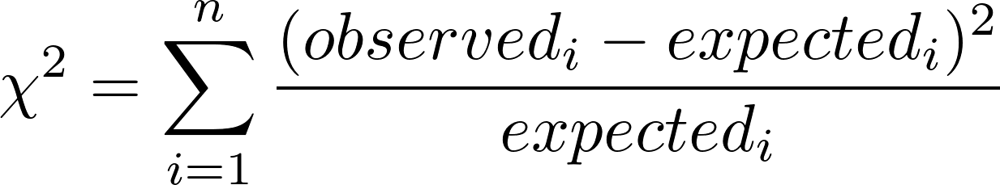
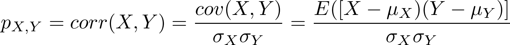

# Machine Learning

This repository will be used as a resource to prepare for a data scientist interview as well as a general resource for myself to look back to. 

## What We Expect From You, I.e., Your Qualifications

    Bachelor’s degree in Computer Science, Information Science, Mathematics, Physics or related discipline and 7 - 10 years of experience in that field. Master’s degree with 6 – 9 years of experience.
 
 I have just completed my bachelors degree in **Applied Mathematics** along with a Computer Science minor. I have been programming for about 8 years now with my introductory programming expreiences coming from classes made available to me my sophomore year of high school. After my introduction to Computer Science through introductory and intermediate Computer Science classes my sophomore year, I then went on to take AP Computer Science my Junior year and lead the Computer Science club in building apps and Java projects my Senior year. 
 
 For my first year of college I attended SUNY Fredonia, where I planned to major in Computer Science on the advanced computing track. I was able to test out of the first two Computer Science classes while continuing to take them for experience handling common tasks in **C++**, as in high school I mainly programmed in Java. Due to my testing out and with the aid of the chair of the Computer Science department I was able to take Data Structures my first semested of my college experience, leading to me taking Analysis and Design of Algorithms my second semester and competing on a competitive programming team.
 
 Though I had gained valuable experience in Mathematics (Discrete Math for Computer Science I and II, Calculus I and II), I believed that another institutuion may provide more opportunites for available higher level courses in different fields that peaked my interests. Upon transferring to **SUNY Oswego** for my sophomore year of college, I was lucky enough to gain entrance in to the first course in a two course series in **Artificial Intelligene**, learning about state-space problem solvers, genetic algorithms and other early breakthroughs in AI as we were learning the langauge that most of these staples to the field were written in, **Common LISP**. I continued on to take the second course in this series, which again was very lucky as it only came around once every two years and it happened to fall after the period when I took the first course in the series. 
 
 At Oswego I had the chance to take many exciting Computer Science courses including Systems Programming in which I got more intimate with the shell (later having to create a Tiny Shell implementation), Natural Language processing in which I used **Python** and the **NLTK (Natural Language Tool Kit)** in order to implement theoretical language processing tasks that we were reviewing in class. Though Computer Science is what truly excites me, I knew after taking this second AI course (In which I implemented a **Feed Forward Neural Network** from scratch) that I needed a firmer Mathematical background. This lead me to change my major to Applied Mathematics, as the good thing to do is not always the easy thing.
 
 All in all I am very pleased with my formal education as well as the two **Summer Research Positions** that I was able to aquire along the way due to my academic performance and previous project successes.
    
    Proficiency in Python.
    
Python has genuinely come about as my favorite programming language. It is elegant in the brevity and readability of the code, allowing a master of the language to accomplish much in one line while still allowing programmers not-so-familiar with the language to understand what the code is doing. As we will later see in this repository, Python also has many useful libraries that are continually updated, and has found itself to be in the center of attention in this time of Machine Learning revolution and popularity due to widely supported libraries. This support includes **Google Cloud**, that allows users to run their Machine Learning algorithms on the most up to date hardware, including the newest **TPUs**. 

I very recently have had extensive experience with Python as I am finally graduated and have the choice of langauge that I would like to work with on my independent projects and choose employers that also enjoy the same langauge that I do. This experience comes from some Bioinformatics training that I have been doing, very helpful for learning the language as after every problem I can consult the forum of answers to see if there is any solution that is remarkably elegant that I can learn from -- thus the reason why some problems on my [Rosalind Python Training Repository](https://github.com/jakesauter/rosalind_python_training) have 2 or more solutions.
    
    Experience with machine learning and data modeling techniques such as decision trees, random forests, SVM,
    neural networks and incremental response.
    
    
[**Capstone Project Machine Learning Week 1**](https://github.com/jakesauter/Molecular_Classification_Capstone/blob/master/files/Machine_Learning.pdf)

  * Machine Learning problem types
  * Supervised / Unsupervised learning
  * Model assessment (confusion matrices / cross-validation / metrics)
    * Not covered here: FOC curve, but previous experience with FOC in 2017 REU
  * Feature selection
  * Quadratic and Linear discriminants
  * K-Nearest-Neighbor
  * Decision Trees
  * Neural Nets (BRIEF)
  * SVMs (Covered more thoroghly in next presentation)
  * Results from KNN applications to data

[**Capstone Project Machine Learning Week 2**](https://github.com/jakesauter/Molecular_Classification_Capstone/blob/master/files/Machine_Learning_Continued.pdf)

 The motivation for this presentation was to really get a hold of the mathematical foundations, capabilites and limits of SVMs, so in the most thorogh manner capable in a weeks span, I began with the foundations of Logistic Regression and worked towards SVMS, while following **Andrew NG's** [machine learning Coursera course](https://www.coursera.org/learn/machine-learning).
 
  * Logistic Regression
    * Linear Boundaries
    * Non-Linear Boundaries
    * Fitting Parameters (Using **Gradient Descent** of cost function)
  * SVMs
    * Regualarization
    * Output Interpretation
  * Random Forests (BRIEF)
  * Applications of KNN, Decision Tree, Random Forest, SVM, Logistic Regression
    
### Decision Trees
    
I have studied decision trees in Python during my 2017 summer REU in medical informatics. During this time my research was involved with **uncertainty** in machine learning problems, where the exact true label of a sample wasn't known, but the probability distribution of the sample over a discrete number of classes was known. This form of problem lead to the use of **Belief Decision Trees**, in which the decision node was not a specific class, but a probability distribution over all possible classes called a pignistic probability. For this reserach we compared the performance of this kind of classifier with **standard decision trees** as well, so I do have some expereience with common implementations as well. 

I also have previous experience with decision trees in R, though it was breif experience. I have learned that decision trees are usually binary decision trees (meaning a two way split at each node) even though that this is not the best way to split the input space. This is due to the ability to often easy interpretation by experts and even by ordinary users of this method. Decision trees are widely implemented in supervised machine learning approaches for this quality.

In reviewing decision trees I found a [video made by the Google Developers Youtube channel](https://www.youtube.com/watch?v=LDRbO9a6XPU&t=526s) extremely helpful in decifering **Gini impurity** and **information gain**.

  

### Random Forests

I came across random forests a few times in my academic career, though have only implemented them before breifly in R for my aforementioned [Capstone Project](https://github.com/jakesauter/Molecular_Classification_Capstone).

### Support Vector Machines (SVMs)

Again, I have come across SVMs a few times in my studies and research. I put them to use during my [last summer's research](https://github.com/jakesauter/lateralization_project), though have more thoroughly studied them guided by my interest during my [Capstone Project](https://github.com/jakesauter/Molecular_Classification_Capstone). 

### Artificial Neural Networks (ANNs)

My experience with ANNs comes from my Sophomore year A.I. [semester-long indepedent research project](https://jakesauter.github.io/course-sites/csc466_project.html) in which I implemented a Common LISP program that could construct aribitrary architectues of a simple **feed-forward ANN**. This ANN was used for memory compression of a form of board game solutions found via **Rote learning**.

### Incremental Response

I have not heard the term "Incremental Response" before this prompt, though I was intially struck by the idea of **gradient descent**, and how the solution of a problem can be updated incrementally to achieve the optimal solution. With a little looking around I found a [maketing training website](https://blogs.sas.com/content/subconsciousmusings/2013/07/12/how-incremental-response-modeling-can-help-you-reach-the-right-target-group-more-precisely/) that described incremental response as a sort of experimental design, **second order** effects are attempted to be minimized while model changes are **incrementally added** in order to truly judge their effects on the model. 
    
    Experience with statistical tests and procedures such as ANOVA, Chi-squared, correlation,
    regression, and time series.
    
As noted before the reason for my change of major to Applied Mathematics was to form a more solid mathematical background. Once I began my full-time math studies I found Statistics to be the most intersting (and most likely the most probable to be useful in my career path) of the topics was studying, and thus let this guide me into taking more Statistics classes then required and performing a [**Capstone Project**](https://github.com/jakesauter/Molecular_Classification_Capstone) in Statistics applied to molecular genomics. 
   
### ANOVA

Also during my last semester at SUNY Oswego I had the pleasure of taking a **Non-parametric Statistics Course** in which we reviewed **ANOVA**, while covering implemetnations in the **R programming language**

Analaysis of Variance (ANOVA) is a statisitical test to **analyze the differences among group means in a sample**. In order for the **parametric** version of ANOVA to be valid,
* The distribution of the **residuals** of the group means the values within each group must be Normally distributed.
* The variances of all of the groups are equal 
* No temporal or spatial (or any other in fact) trend is present
* Data values are independent and random

If some or none of these assumptions are met the **non-parametric Kruskal-Wallis test** may be applicable. 

Both of these test were covered in [Environmental Statistics HW 4](files/Environmental_Statistics_HW_4.pdf), also at this time I welcome you to look the the previous 3 homeworks that are also in the files directory, links below. 

[Environmental Statistics HW 1](files/Environmental_Statistics_HW_1.pdf)

[Environmental Statistics HW 2](files/Environmental_Statistics_HW_2.pdf)

[Environmental Statistics HW 3](files/Environmental_Statistics_HW_3.pdf)

### Chi-Squared

During the second semester of my Junior year I enrolled in Mathematical Statistics II in which we reviewed the mathematical foundations of many Statistical tests and concepts, Chi-Squared was included in these studies.

The Chi-Squared test is used to determine if there is a statistically significant difference in the expected versus observed sizes of groups for the Pearson Chi Square test, which is used for categorical data. The standard definition of statistical significance is applied here, with a common p-value of .05.

  
 
 The Chi-Squared test can also be applied in the continuous case to determine if a sample from a normally distributed population has a particular varaince. The test statistic is normally referred to as T and could be set to be the sum of squares about the sample mean, divided by the nominal value for the variance (i.e. the value to be tested as holding). Then T has a chi-squared distribution with n − 1 degrees of freedom.

### Correlation 

Pearson Correlation Coefficient

 

### Regression

During the previously mentioned non-parametric statistics course **simple linear regression** and **multiple linear regression** were also covered. These were implemented in R in class on simple data sets along with evaluating the **r-squared**, **adjusted r-squared** and **F-test** of the model.

### Time Series
    
I do not have much expereience with time series analysis though I have attended a talk in which a **recurrent neural network**(LSTMs) was used to predict results of sports games based on a sliding window of previous sports game results. I found an [intersting blog](https://blog.statsbot.co/time-series-prediction-using-recurrent-neural-networks-lstms-807fa6ca7f) of this topic that I will be sure to review more closely before the interview.
    
    Experience with survey sampling methodologies and data collection techniques.
   
In the now seemingly very useful non-parametric statistics course that I had the pleasure of taking I was also exposed to many different sampling methodologies as we must be aware of the bias that can be introduced with different sampling methods, and even some methods are only applicable if certain sampling techniques are performed due to assumptions that must be met for statisticall sound tests.
       
    Ability to lead small-sized teams.

During my time at iD tech I found myself leading others and organizing many internal situations. As a technical coordinator my job was to make sure that the camp ran smoothly, assisting technology issues in the camp and instructing students that needed more help in my free time.
    
    Applicants selected will be subject to a government security investigation and must meet eligibility requirements
    for access to classified information. U.S. citizenship is required.
    
I am a United States citizen. As I currently am employed part-time by FedEx Express, I have airport security clearance.

## Nice To Haves

    Experience with SciPy, NumPy and Pandas packages.
    
From my 2017 REU in Medical Informatics and other various times I have encountered these packages that make scientific computing much easier.

[SciPy](https://docs.scipy.org/doc/scipy/reference/) -- Tutorial for SciPy from official docs

[NumPy](https://docs.scipy.org/doc/numpy/user/basics.html) -- NumPy basics from official docs

[Pandas](https://pandas.pydata.org/) -- Official docs for Pandas library
    
    
    Experience with Theano, Torch, Caffe, Tensorflow, Leaf or Autumn.
    
I have had brief expereience with Tensorflow during my Sophomore year AI project, in which I used Tensorflow to test my ANN architecture with the **Adam Optimizer** to see if in the very best possible case of my implmentation that the architecture would work. 

[simple_mlp_tensorflow.py](files/simple_mlp_tensorflow.py)

[simple_feed_forward_net.py](files/simple_feed_forward_net.py)

[dobo_nn_continuous_feed_forward.py](files/dobo_nn_continuous_feed_forward.py)
    
    
    Experience with developing in a Linux environment.
    
I have been using Linux as my main operating system for close to 4 years now througout my Computer Science career. I have developed solely in Ubuntu during this whole period and find the ease of use for programming applications to be unparalled. I mainly used **Vim** as my editor of choice for about 2 years as I also did a lot of work on server, though now my editor of choice is **Gedit** with my configurations of plugins that help accelerate my workflow. I prefer these lightweight editors as I find larger editors to be clunky and many of the tools getting in the way of my development. 
    
    
    Knowledge of machine learning acceleration techniques.
    
When I think of "machine learning acceleration techniques" I am thinking of using the appropriate hardware for the job. I have made a few short programs on **Google Cloud** in which users have the option to make use of TPUs, GPUs or stadard chips. 
    
    Knowledge of radio communication technologies, i.e., coursework, amateur radio, etc.
    
The only experience I have involving anything close to radio technologies is the theoretical concepts covered in Electromagnetics (Physics II) 
    
    Knowledge of or past experience working within an agile environment.
    
As most of my work has been independent or small-team reserach, I have not had any active hands-on expereience with the agile environment. I am aware of basics of the agile system and am always up to learning new development processes.    
    
    Experience with writing government proposals.
    
I have no experience in writing government proposals.    
    
    Active security clearance.

I have an active Syracuse Hancock Airport security clearance, though no direct governmental security clearances.
